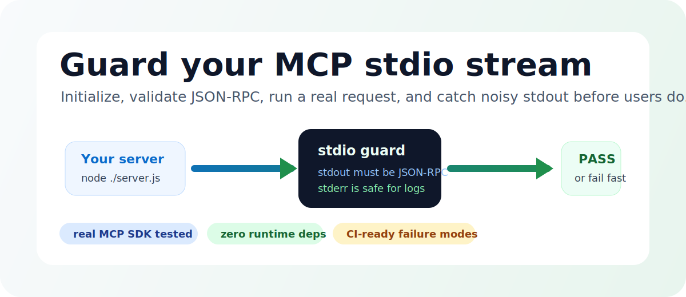
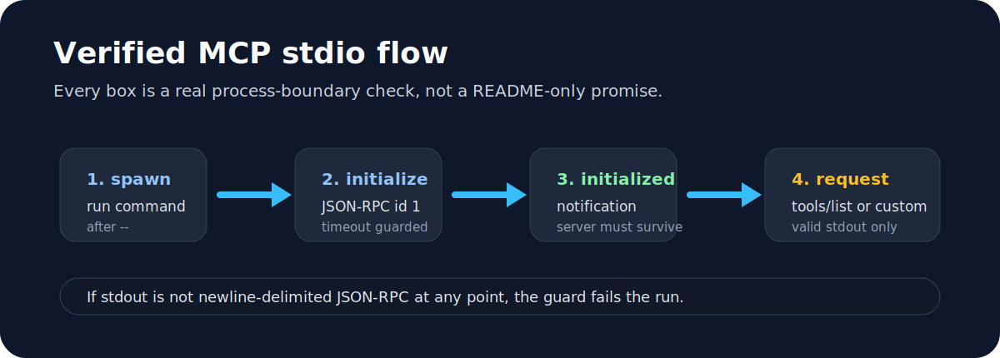
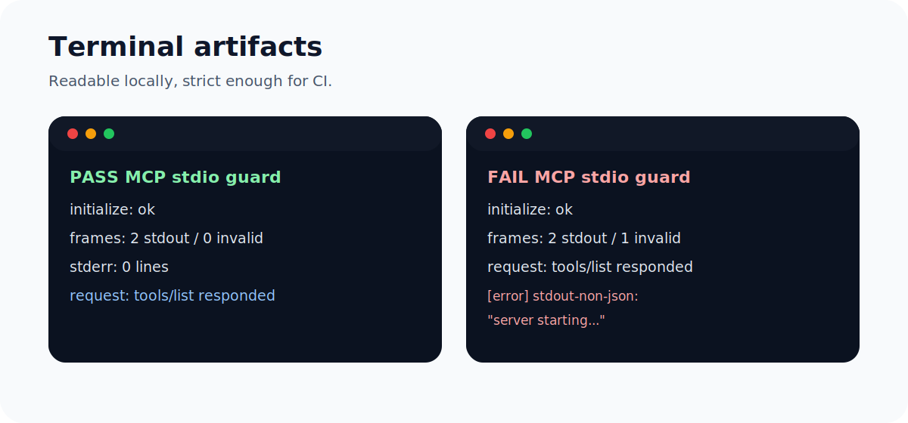

<p align="center">
  
</p>

<h1 align="center">mcp-stdio-guard</h1>

<p align="center">
  Catch stdout pollution and handshake failures in MCP stdio servers before clients do.
</p>

<p align="center">
  <a href="https://github.com/1Utkarsh1/mcp-stdio-guard/actions/workflows/ci.yml"></a>
  <a href="https://www.npmjs.com/package/mcp-stdio-guard"></a>
  
  
  <a href="LICENSE"></a>
</p>

<p align="center">
  
</p>

MCP stdio servers use stdout as their protocol channel. Debug text, banners, progress logs, `console.log`, Python `print`, or any other stray stdout output can corrupt the stream and make clients fail in confusing ways.

`mcp-stdio-guard` starts your server, performs a real MCP initialize handshake, optionally sends a real post-initialize MCP request such as `tools/list`, validates every stdout frame, and scans source for risky stdout calls.

## Why This Exists

The latest MCP docs say [stdio servers must send JSON-RPC messages on stdout](https://modelcontextprotocol.io/specification/2025-11-25/basic/transports), may log to stderr, and must complete the [`initialize` then `notifications/initialized` lifecycle](https://modelcontextprotocol.io/specification/2025-11-25/basic/lifecycle) before normal operation.

That is easy to get wrong in real servers. This guard turns that fragile process boundary into a fast local check and a CI gate.

<p align="center">
  
</p>

## Install

From npm:

```bash
npx mcp-stdio-guard -- node ./server.js
```

From this repo:

```bash
git clone https://github.com/1Utkarsh1/mcp-stdio-guard.git
cd mcp-stdio-guard
npm ci
npm test
```

## Quickstart

Run your MCP server behind the guard:

```bash
mcp-stdio-guard -- node ./server.js
```

Exercise a real MCP operation after initialization:

```bash
mcp-stdio-guard --request tools/list -- node ./server.js
```

Scan source for obvious stdout writes too:

```bash
mcp-stdio-guard --scan src --fail-on-static --request tools/list -- node ./server.js
```

JSON output for CI:

```bash
mcp-stdio-guard --json --request tools/list -- node ./server.js
```

Repeat the same guard to catch cold/warm startup behavior:

```bash
mcp-stdio-guard --repeat 2 --request tools/list -- node ./server.js
```

## What It Catches

<p align="center">
  
</p>

| Problem | Runtime check | Static scan |
| --- | --- | --- |
| `console.log("starting")` before server startup | Yes | Yes |
| Dependency/import-time stdout pollution | Yes with `--repeat` | No |
| Python `print("debug")` in a stdio server | Yes | Yes |
| Late stdout logs after `initialize` | Yes | Partial |
| Invalid JSON-RPC frames | Yes | No |
| Server crash after `notifications/initialized` | Yes | No |
| Missing `initialize` or operation response | Yes | No |
| stderr diagnostics | Allowed | Allowed |

## Live MCP Coverage

The test suite creates real servers with `@modelcontextprotocol/sdk@1.29.0` and verifies:

| Scenario | Expected result |
| --- | --- |
| clean SDK stdio server through `initialize` and `tools/list` | Pass |
| SDK server with startup stdout pollution | Fail |
| SDK server with stderr diagnostics | Pass |
| SDK server with late stdout pollution after connection | Fail |
| hand-rolled server that ignores post-initialize requests | Fail |
| server that crashes after initialized notification | Fail |

## Commands

```bash
mcp-stdio-guard [options] -- <command> [args...]
```

| Option | Description |
| --- | --- |
| `--protocol <version>` | MCP protocol version to send, default `2025-11-25` |
| `--timeout <ms>` | initialize and request timeout, default `5000` |
| `--repeat <count>` | run the same guard multiple times to catch cold/warm startup behavior |
| `--request <method>` | send one MCP request after initialization, for example `tools/list` |
| `--params <json>` | JSON params for `--request` |
| `--scan <path>` | scan source for risky stdout writes |
| `--fail-on-static` | make static scan findings fail the command |
| `--json` | print machine-readable output |
| `--cwd <path>` | run the server command from a specific directory |
| `--help` | show help |

## CI

```yaml
- run: npm ci
- run: npx mcp-stdio-guard --scan src --fail-on-static --request tools/list -- node ./server.js
```

## Output

Passing server:

```text
PASS MCP stdio guard
initialize: ok
frames: 2 stdout / 0 invalid
stderr: 0 lines
protocol: 2025-11-25
request: tools/list responded
```

Polluted stdout:

```text
FAIL MCP stdio guard
initialize: ok
frames: 2 stdout / 1 invalid
stderr: 0 lines
protocol: 2025-11-25
request: tools/list responded
[error] stdout-non-json: stdout line 1 is not JSON-RPC: "server starting..."
```

## Design

- Runtime dependencies: zero.
- Default behavior: validate the real process boundary.
- Optional static scan: intentionally simple and conservative.
- CI posture: fail on protocol corruption, crashes, and missing responses.
- Promotion promise: no fake stars, no spam, just a tool that catches a real MCP failure mode.

## License

MIT
